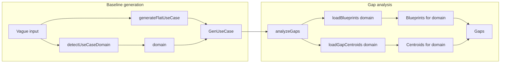

<!-- f05063ed-2b8d-4147-88d2-790348fe8720 -->
# Domain-Scoped Blueprints and Centroids

## Goal

- **Domain signal at baseline generation**: Detect `human_machine` vs `machine_machine` from the vague input using a dedicated prompt (no change to the main extraction prompt/schema).
- **Data separation**: Tag blueprints and centroid categories by domain; at gap analysis time, only activate those matching the use case’s detected domain.
- **Backward compatibility**: When `domain` is missing (e.g. existing tests), treat as “all” (current behavior) or default to `human_machine` so nothing breaks.

## Architecture

## 1. Domain detection (vague input, at baseline time)

**Where**: New function in `mcp-thesis/src/services/usecase.service.ts` (or a small `domain.detector.ts` if you prefer a separate module).

- **Function**: `detectUseCaseDomain(description: string, geminiFunctions: GeminiOpenRouterFunctions): Promise<"human_machine" | "machine_machine">`.
- **Implementation**: Single LLM call with a short prompt that:
  - Takes the same vague description used for baseline.
  - Asks whether the use case is primarily **human–machine** (users, forms, approvals, requests, selection) or **machine–machine** (protocols, services, resources, timers, APIs, system-to-system).
  - Returns exactly one of the two labels.
- **Output**: Use structured output (Zod schema) so the response is parseable and typed.

**Call sites** (immediately after generating the baseline, so “domain in baseline generation”):

- `mcp-thesis/src/tools/testingTools.ts`:
  - In **runHITLComparison**: after `generateFlatUseCase` for `baseline`, call `detectUseCaseDomain(tc.inputs.vague, geminiFunctions)`, set `baseline.domain` and `currentUseCase.domain`.
  - Optionally run domain detection for `detailedBaseline` from `tc.inputs.detailed` if you want domain on that too; otherwise leave it unset or reuse vague-based domain for the run.
  - In **hitl_generateBaseline** (interactive): after `generateFlatUseCase`, call `detectUseCaseDomain(description, geminiFunctions)` and set `baseline.domain`.
- **prepareTestData** / **runCOVEComparison**: only need domain if they later feed into HITL; for a minimal first version, you can add domain only where the baseline is used for iterative HITL (runHITLComparison + hitl_generateBaseline).

## 2. Attach domain to the use case

- **`mcp-thesis/src/interfaces/usecase.interface.new.ts`**: Add optional field to `GenUseCase`:
  - `domain?: "human_machine" | "machine_machine";`
- **`mcp-thesis/src/schemas/genusecase.schema.ts`**: Add optional field so persisted/validated use cases can carry domain:
  - `domain: z.enum(["human_machine", "machine_machine"]).optional()`
- No change to the main `generateFlatUseCase` prompt or schema; domain is set **after** generation by the new detector.

## 3. Blueprints: tag by domain and filter on load

- **`mcp-thesis/src/data/blueprints.json`**:
  - Add a `"domain"` field to each blueprint. All four current blueprints are human–machine:
    - `approval_chain`, `request_lifecycle`, `multi_party_selection`, `information_completeness` → `"domain": "human_machine"`.
  - If you introduce machine–machine blueprints later, add them with `"domain": "machine_machine"` (can be empty array for now).
- **`mcp-thesis/src/analyzers/blueprint.detector.ts`**:
  - Extend `BlueprintDefinition` (or file-level interface) with `domain: "human_machine" | "machine_machine"`.
  - Change `loadBlueprints()` to `loadBlueprints(domain?: "human_machine" | "machine_machine")`. If `domain` is provided, return only blueprints where `blueprint.domain === domain`. If `domain` is missing, return all (backward compatible).
  - Cache: keep a single cache of the full list; filter after load (or cache keyed by domain if you prefer; filtering is simpler).
  - `detectBlueprintGaps(useCase, embeddedSteps)`: pass `useCase.domain` into `loadBlueprints(useCase.domain)` so only domain-matching blueprints run.

## 4. Centroids: tag by domain and filter on load

- **`mcp-thesis/src/data/gap-centroids.json`**:
  - Add a `"domains"` array to each category (so a category can apply to both domains if needed):
    - Human–machine–oriented (forms, approval, data entry, save/resume): `validation`, `search_lookup`, `data_input`, `resource_assignment`, `completion`, `save_resume` → `"domains": ["human_machine"]`.
    - Shared (could apply to both): `system_interaction`, `vague_condition` → `"domains": ["human_machine", "machine_machine"]`.
    - When you add machine–machine–only centroids (e.g. `concurrent_access`, `timer_lifecycle`), set `"domains": ["machine_machine"]`.
- **`mcp-thesis/src/analyzers/gap.analyzer.ts`**:
  - Extend `GapCategory` with `domains?: ("human_machine" | "machine_machine")[]` (optional for backward compat).
  - Extend `GapCentroidData` / parsing so each category can have `domains`.
  - `loadGapCentroids(domain?: "human_machine" | "machine_machine")`: if `domain` is provided, return only categories whose `domains` includes `domain`. If a category has no `domains`, treat as applicable to both (or only `human_machine` by default). If `domain` is missing, return all categories.
  - Cache: keep loading the full file and computing centroids once; filter the resulting array by domain before returning. Invalidate cache when the file changes (existing `clearGapCentroidsCache`).
  - `analyzeGaps(useCase, ...)`: pass `useCase.domain` into `loadGapCentroids(useCase.domain)` and use the returned list for blueprint skip-set and centroid steps (existing logic unchanged except it receives a filtered list).

## 5. Wire domain through gap analysis

- **`mcp-thesis/src/analyzers/gap.analyzer.ts`**:
  - In `analyzeGaps`, read `useCase.domain`.
  - Replace `loadGapCentroids()` with `loadGapCentroids(useCase.domain)`.
  - Pass `useCase.domain` into `detectBlueprintGaps` (which will call `loadBlueprints(useCase.domain)`).
- **`mcp-thesis/src/analyzers/blueprint.detector.ts`**:
  - `detectBlueprintGaps(useCase, embeddedSteps)`: call `loadBlueprints(useCase.domain)` instead of `loadBlueprints()`.

## 6. Default when domain is missing

- If `useCase.domain` is undefined (e.g. use cases generated before this change, or from tools that don’t set it):
  - **Option A**: Pass `undefined` to `loadBlueprints` and `loadGapCentroids`; both return “all” (current behavior).
  - **Option B**: Default to `human_machine` so machine–machine blueprints never run and only human_machine centroids run.

Recommendation: **Option A** (return all when domain is missing) to avoid changing behavior for existing datasets; you can switch to Option B later if you want a stricter default.

## File summary

| File | Change |
|------|--------|
| `usecase.service.ts` | Add `detectUseCaseDomain(description, geminiFunctions)` with prompt + Zod; call it from callers that need domain. |
| `usecase.interface.new.ts` | Add `domain?: "human_machine" \| "machine_machine"` to `GenUseCase`. |
| `genusecase.schema.ts` | Add optional `domain` enum to schema. |
| `blueprints.json` | Add `"domain": "human_machine"` to each blueprint. |
| `gap-centroids.json` | Add `"domains": [...]` to each category. |
| `blueprint.detector.ts` | Add `domain` to blueprint type; `loadBlueprints(domain?)` filter; `detectBlueprintGaps` uses `useCase.domain`. |
| `gap.analyzer.ts` | Add `domains` to `GapCategory`; `loadGapCentroids(domain?)` filter; `analyzeGaps` uses `useCase.domain` for both loaders. |
| `testingTools.ts` | After each `generateFlatUseCase` that feeds HITL, call `detectUseCaseDomain` and set `baseline.domain` / `currentUseCase.domain`; in interactive tool set `baseline.domain`. |

## Testing

- Run **runHITLComparison** on a human–machine case (e.g. BOS): expect domain `human_machine`, all four blueprints and human_machine centroids active.
- Run on a machine–machine case (e.g. CC1): expect domain `machine_machine`, no current blueprints (or only future machine_machine ones), only machine_machine + shared centroids active.
- Run with a use case that has no `domain` set: expect same behavior as today (all blueprints and centroids), or Option B default if you choose that.

## Out of scope (for later)

- Adding new machine_machine blueprints or centroids (e.g. `concurrent_access`, `timer_lifecycle`) is separate; this plan only adds the domain field and filtering so they can be switched on by domain later.
- Changing the main extraction prompt/schema for baseline generation is not required; domain is detected in a separate, dedicated step.
