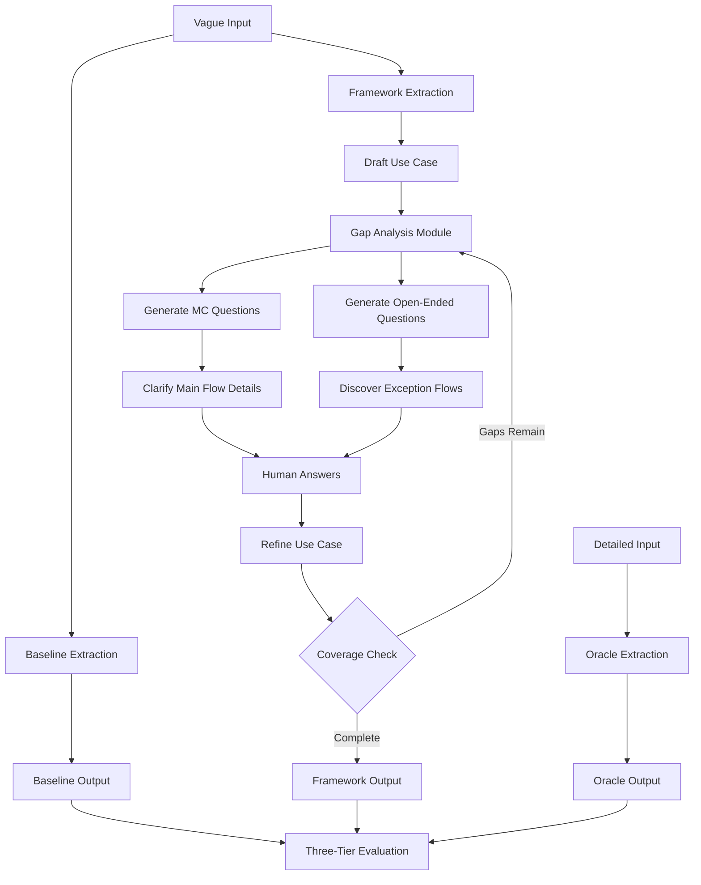

# Redesign HITL Research Framework

## Problem Statement

Current research has two critical flaws:

1. **Detailed COVE proves nothing** - Any LLM with structured output can extract from detailed specs
2. **MC questions miss exception flows** - Only discovered 1/4 flows (25% discovery rate)

## Research Goal

**Prove your framework is better than baseline LLM extraction when starting from vague requirements.**Key comparison:

- **Baseline**: Vague input → LLM structured output (no framework)
- **Your Framework**: Vague input → Gap analysis → Hybrid questions → Refined output
- **Oracle**: Detailed input → LLM (upper bound for comparison)

## Architecture Changes




## Implementation Plan

### 1. Create Gap Analysis Module

**New file**: `src/analyzers/gap.analyzer.ts`Implement gap detection logic:

- **Exception flow gaps**: Check validation scores, look for missing EXCEPTION flows
- **Alternative flow gaps**: Detect single-path main flows without alternatives
- **Actor completeness**: Identify mentioned but unused actors
- **Business logic gaps**: Flag uncertain conditions (detected from validation feedback)

Key function:

```typescript
export async function analyzeGaps(
  useCase: GenUseCase,
  validationFeedback: UseCaseTermScore,
  originalDescription: string
): Promise<GapAnalysis> {
  return {
    missingExceptionFlows: boolean,
    missingAlternativeFlows: boolean,
    incompleteActors: string[],
    uncertainConditions: string[],
    priorityGaps: GapType[] // ordered by importance
  }
}
```


### 2. Enhance Question Generation (Hybrid Approach)

**Modify**: [`src/validators/llm.validator.ts`](src/validators/llm.validator.ts)**Add new function**: `generateHybridQuestions`

- Takes gap analysis as input
- Generates MC questions for main flow clarifications (keep existing logic)
- Generates open-ended questions specifically targeting exception flows

Exception flow discovery prompts:

```typescript
const exceptionFlowPrompts = [
  "What could go wrong during {step}? List all possible failure scenarios.",
  "Are there any exceptional cases where the normal flow cannot complete?",
  "What system failures or external issues should this use case handle?",
  "What validation errors or data mismatches might occur?"
];
```

Output structure:

```typescript
{
  mcQuestions: MultipleChoiceQuestion[],  // For clarifications
  openEndedQuestions: OpenEndedQuestion[] // For exception discovery
}
```


### 3. Update Refinement Service

**Modify**: [`src/services/usecase.service.ts`](src/services/usecase.service.ts)**Add new function**: `refineWithHybridAnswers`

- Processes both MC and open-ended answers
- Integrates exception flows from open-ended responses
- Uses existing `refineWithConstrainedAnswers` for MC
- Adds new flows for discovered exceptions

Key logic:

```typescript
// 1. Apply MC answers (constrained refinement)
let refined = await refineWithConstrainedAnswers(draft, mcAnswers);

// 2. Extract exception flows from open-ended answers
const newFlows = await extractExceptionFlows(openEndedAnswers);

// 3. Integrate new flows into use case
refined.flows.push(...newFlows);

return refined;
```


### 4. Redesign Testing Comparison

**Modify**: [`src/tools/testingTools.ts`](src/tools/testingTools.ts)**Replace `runCOVEComparison` with `runFrameworkComparison`:**New comparison conditions:

- **Condition A (Baseline)**: Vague → `generateFlatUseCase` → Done (no framework)
- **Condition B (Framework)**: Vague → Draft → Gap analysis → Hybrid questions → Refinement
- **Condition C (Oracle)**: Detailed → `generateFlatUseCase` → Done (upper bound)
```typescript
server.registerTool(
  "runFrameworkComparison",
  {
    title: "Framework vs Baseline Comparison",
    description: "Compare framework against baseline LLM extraction (both from vague input)",
    inputSchema: {
      datasetPath: z.string(),
      testCaseIds: z.array(z.string()).optional(),
    },
  },
  async ({ datasetPath, testCaseIds }) => {
    // For each test case:
    // 1. Baseline: generateFlatUseCase(vague)
    // 2. Framework: full pipeline with hybrid questions
    // 3. Oracle: generateFlatUseCase(detailed)
  }
);
```


**Keep `runHITLComparison` but update** to use new hybrid approach instead of MC-only**Keep `evaluateResults`** unchanged - still uses three-tier evaluation

### 5. Update Dataset Structure

**Modify test data expectations:**

- **vague**: Short, incomplete description (realistic user input)
- **detailed**: Full specification (oracle reference)
- **groundTruth**: Expected complete use case

The vague input should intentionally omit exception scenarios to simulate realistic conditions.

## Testing Strategy

### Test Case Requirements

Each test case needs:

1. **Vague summary**: No mention of exceptions (e.g., "Register box arrival")
2. **Detailed description**: Includes all exception flows explicitly
3. **Ground truth**: Complete structured use case with all flows

### Expected Results

| Metric | Baseline | Framework | Oracle ||--------|----------|-----------|--------|| Quality Score | High (~90%) | High (~90%) | High (~90%) || Discovery Rate | Low (~25%) | High (~80%+) | Very High (~100%) || F1 Score | Low (~40%) | High (~80%+) | Very High (~100%) |**Success criteria**: Framework discovery rate ≥ 80% (approaching Oracle), significantly better than Baseline's ~25%

## Implementation Todos

### Core Components

- Create gap analyzer module with exception flow detection
- Add hybrid question generation (MC + open-ended)
- Implement open-ended answer processing for exception flows
- Create `refineWithHybridAnswers` service function

### Testing Infrastructure

- Replace `runCOVEComparison` with `runFrameworkComparison`
- Update HITL comparison to use hybrid questions
- Maintain three-tier evaluation compatibility

### Validation

- Test gap detection accuracy
- Verify exception flow extraction from open-ended answers
- Run comparison on MO1 test case
- Validate that Framework >> Baseline in discovery rate

## Key Files to Modify

1. **New**: `src/analyzers/gap.analyzer.ts` - Gap detection logic
2. **Modify**: [`src/validators/llm.validator.ts`](src/validators/llm.validator.ts) - Add hybrid question generation
3. **Modify**: [`src/services/usecase.service.ts`](src/services/usecase.service.ts) - Add hybrid refinement
4. **Modify**: [`src/tools/testingTools.ts`](src/tools/testingTools.ts) - Replace COVE comparison with Framework comparison
5. **Update**: Test data structure in `test-data/` directory

## Success Metrics

Research proves value if:

1. **Framework discovery >> Baseline discovery** (target: 80% vs 25%)
2. **Framework discovery ≈ Oracle discovery** (within 20 percentage points)
3. **Minimal question overhead** (≤ 5 questions to reach high discovery)
4. **Quality maintained** (≥ 85% quality score across all conditions)